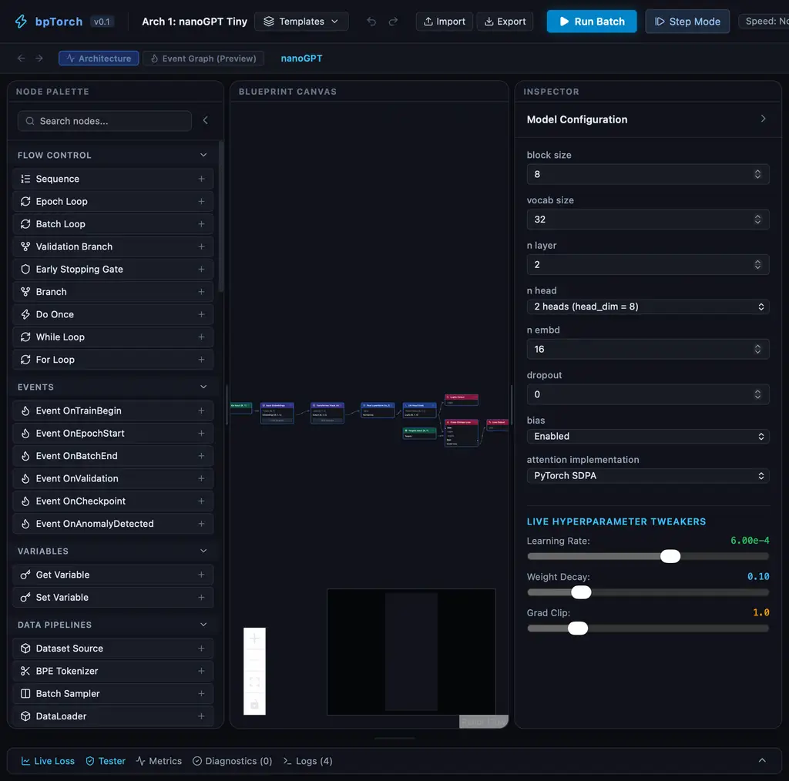

<p align="center">
  
</p>

<h1 align="center">bpTorch</h1>

<p align="center">
  <strong>Blueprint-style visual editor for PyTorch neural architectures.</strong><br/>
  Draw the graph. Compile to <code>torch.nn.Module</code>. Train, trace, and infer — locally.
</p>

<p align="center">
  <a href="https://github.com/DJLougen/bptorch/releases/tag/v0.1.0"></a>
  <a href="LICENSE"></a>
  
  
  
</p>

---

## What is bpTorch?

bpTorch is a **local-first visual IDE** for building neural networks the way you'd wire Blueprints in Unreal Engine — but every connection is a real tensor dependency, and every node compiles into actual PyTorch operations.

```text
Visual Graph  →  Canonical Model IR  →  Shape Validation  →  PyTorch Runtime  →  Real Tensors & Loss
```

No code generation step. No cloud. No telemetry. The canvas **is** the model.

<p align="center">
  
  <br/>
  <em>Resizable bento workspace: palette · canvas · inspector · diagnostics drawer</em>
</p>

## Features

| | |
|---|---|
| **Executable Visual Graph** | Compiles directly to `torch.nn.Module` with real parameters |
| **25 Architecture Samples** | Transformers, MLPs, training pipelines — load from **Templates → Architecture Samples** |
| **Hierarchical Subgraphs** | Drill into Transformer Stack → Block → Attention with breadcrumb navigation |
| **Shape & Type Engine** | Propagates `B`, `T`, `C`, `V` dimensions; catches mismatches before run |
| **Blueprint Tracing** | WebSocket execution events, breakpoints, step/continue, tensor stats |
| **Inference Engine** | Forward-only `POST /api/v1/sessions/{id}/infer` — whole-graph or interpreter mode |
| **nanoGPT Parity** | Verified numerical parity against pinned `karpathy/nanoGPT` |
| **Resizable Bento UI** | Drag handles resize palette, canvas, inspector, and drawer |

## Quick Start

```bash
git clone https://github.com/DJLougen/bptorch.git
cd bptorch
make setup    # Python venv + npm install
make dev      # Backend :8000 + Frontend :5173
```

Open **http://localhost:5173/** → click **Templates** → pick any of the **25 architecture samples**.

```bash
make test            # 247 backend + 30 frontend tests
make parity          # nanoGPT numerical parity suite
make train-samples   # batch-train all 25 architectures
make infer-samples   # batch-infer all 25 architectures
```

## Architecture Samples (25/25 verified)

| Category | Examples |
|----------|----------|
| **Transformers** | nanoGPT Tiny, Deep, Wide, Manual Attention, Single Block, Dropout GPT, bf16 GPT |
| **Feedforward** | Two-Layer MLP, Bottleneck, Deep Tower, Wide & Deep, Pre-norm MLP, Residual Add |
| **Training Pipelines** | Dual-Flow, Warmup, Step-LR, Metric Logger |
| **Classification** | ReLU Classifier, Binary CLS, Multi-task Head |
| **Attention** | Multi-head, Tied LM, SiLU FFN |

Training and inference results are recorded in `examples/training_results.json` and `examples/inference_results.json` — **25/25 passed** for both.

## How It Works

```
┌─────────────┐     ┌──────────────┐     ┌─────────────────┐     ┌──────────────┐
│  React UI   │────▶│  Canonical   │────▶│  GraphCompiler  │────▶│ CompiledGraph│
│  (canvas)   │     │  Model IR    │     │  + Validator    │     │ Module       │
└─────────────┘     └──────────────┘     └─────────────────┘     └──────────────┘
       │                                                              │
       │ WebSocket trace events                                       ▼
       ▼                                                    TrainingSession
┌─────────────┐                                            InferenceEngine
│ Diagnostics │                                            nanoGPT Parity
│ Loss / Logs │
└─────────────┘
```

## Repository Structure

| Path | What |
|------|------|
| `web/` | React 19 + TypeScript + Vite + React Flow frontend |
| `server/neural_blueprint/` | FastAPI + PyTorch runtime, compiler, tracing |
| `examples/` | 25 sample blueprints + training/inference results |
| `packages/contracts/` | JSON schemas + generated TypeScript types |
| `references/nanogpt/` | Pinned nanoGPT reference for parity |
| `docs/adr/` | Architecture Decision Records |
| `docs/images/` | Screenshots and branding assets |

## Requirements

- Python 3.10+ (3.12 recommended) with PyTorch 2.x
- Node.js 18+
- CPU, Apple Silicon (MPS), or CUDA

## Current Limitations (v0.1)

- No arbitrary Python in graph nodes (by design — [ADR 0004](docs/adr/0004-no-general-control-flow-v0.1.md))
- No distributed / multi-node training
- Source code export is post-v0.1

## License

[MIT](LICENSE) — see [THIRD_PARTY_NOTICES.md](THIRD_PARTY_NOTICES.md) for bundled references.
