<p align="center">
  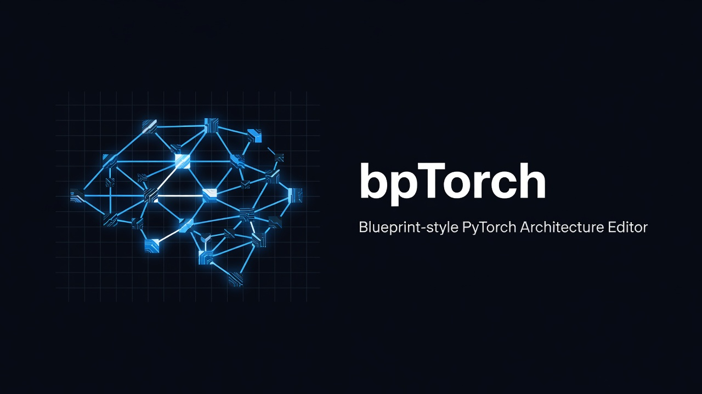
</p>

<h1 align="center">bpTorch</h1>

<p align="center">
  <strong>Blueprint-style visual editor for PyTorch neural architectures.</strong><br/>
  Draw the graph. Compile to <code>torch.nn.Module</code>. Train, trace, and infer — locally.
</p>

<p align="center">
  <a href="https://github.com/DJLougen/bptorch/releases/tag/v0.2.0"></a>
  <a href="LICENSE"></a>
  
  
  
</p>

---

## What is bpTorch?

bpTorch is a **local-first visual IDE** for building neural networks the way you'd wire Blueprints in Unreal Engine — but every connection is a real tensor dependency, and every node compiles into actual PyTorch operations.

```text
Visual Graph  →  Canonical Model IR  →  Shape Validation  →  PyTorch Runtime  →  Real Tensors & Loss
```

No code generation step. No cloud. No telemetry. The canvas **is** the model.

<p align="center">
  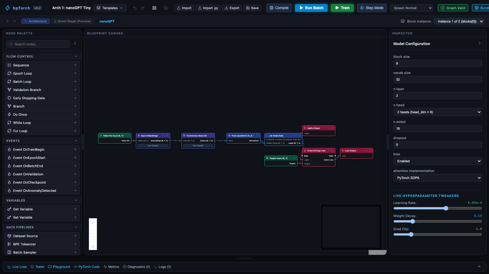
  <br/>
  <em>Resizable bento workspace: palette · canvas · inspector · Train / Import .py / cook / playground</em>
</p>

## Features

| Feature | One-line |
|---|---|
| **Executable Visual Graph** | Compiles directly to `torch.nn.Module` with real parameters |
| **26 Architecture Samples** | Transformers (nanoGPT + Llama Tiny), MLPs, training pipelines |
| **Templates → Architecture Samples** | Hierarchical Subgraphs \| Drill into stacks/blocks; custom composites fork to `custom.<graph_id>` |
| **Train on the canvas** | TopBar **Train** / **Pause**; live train+val loss; batch size live; val fraction |
| **Playground** | Token generation with ChatML / Alpaca / Llama-3 templates |
| **Cook standalone PyTorch** | Bottom drawer **PyTorch Code** → `POST /api/v1/cook/export` |
| **Import `nn.Module`** | TopBar **Import .py** → `POST /api/v1/import/pytorch` (FX; unsupported ops → 422) |
| **Blueprint Tracing** | WebSocket events, breakpoints, step/continue, tensor stats, param/grad norms |
| **nanoGPT Parity** | Verified against pinned `karpathy/nanoGPT` |
| **Resizable Bento UI** | Palette, canvas, inspector, drawer |

## Quick Start

```bash
git clone https://github.com/DJLougen/bptorch.git
cd bptorch
make setup    # Python venv + npm install
make dev      # Backend :8000 + Frontend :5173
```

Open **http://localhost:5173/** → click **Templates** → pick any of the **26 architecture samples**.

```bash
make test            # 279 backend + 49 frontend tests
make parity          # nanoGPT numerical parity suite
make train-samples   # batch-train catalog samples
make infer-samples   # batch-infer catalog samples
```

## Architecture Samples (26)

| Category | Examples |
|----------|----------|
| **Transformers** | nanoGPT Tiny, Deep, Wide, Manual Attention, Single Block, Dropout GPT, bf16 GPT, Llama Tiny (RMSNorm, RoPE, SwiGLU, GQA) |
| **Feedforward** | Two-Layer MLP, Bottleneck, Deep Tower, Wide & Deep, Pre-norm MLP, Residual Add |
| **Training Pipelines** | Dual-Flow, Warmup, Step-LR, Metric Logger |
| **Classification** | ReLU Classifier, Binary CLS, Multi-task Head |
| **Attention** | Multi-head, Tied LM, SiLU FFN |

Training and inference results are recorded in `examples/training_results.json` and `examples/inference_results.json` — **25/25 passed** for the original catalog; Arch 26 is in the sample gallery.

## How It Works

```
┌─────────────┐     ┌──────────────┐     ┌─────────────────┐     ┌──────────────┐
│  React UI   │────▶│  Canonical   │────▶│  GraphCompiler  │────▶│ CompiledGraph│
│  (canvas)   │     │  Model IR    │     │  + Validator    │     │ Module       │
└─────────────┘     └──────────────┘     └─────────────────┘     └──────────────┘
       │                                                              │
       │ WebSocket trace events                                       ▼
       ▼                                                    TrainingSession
┌─────────────┐                                            InferenceEngine
│ Diagnostics │                                            nanoGPT Parity
│ Loss / Logs │
└─────────────┘
Cook / Import .py round-trip via /api/v1/cook/export and /api/v1/import/pytorch
```

## Repository Structure

| Path | What |
|------|------|
| `web/` | React 19 + TypeScript + Vite + React Flow frontend |
| `server/neural_blueprint/` | FastAPI + PyTorch runtime, compiler, tracing |
| `server/neural_blueprint/cooking/` | Standalone PyTorch export |
| `server/neural_blueprint/importing/` | FX `nn.Module` → Project |
| `examples/` | 26 sample blueprints + training/inference results |
| `examples/arch_26_llama_tiny/` | Llama Tiny blueprint |
| `packages/contracts/` | JSON schemas + generated TypeScript types |
| `references/nanogpt/` | Pinned nanoGPT reference for parity |
| `docs/adr/` | Architecture Decision Records |
| `docs/images/` | Screenshots and branding assets |

## Requirements

- Python 3.10+ (3.12 recommended) with PyTorch 2.x
- Node.js 18+
- CPU, Apple Silicon (MPS), or CUDA

## Current Limitations (v0.2)

- No arbitrary Python in graph nodes (by design — [ADR 0004](docs/adr/0004-no-general-control-flow-v0.1.md))
- No distributed / multi-node training: Event graph remains preview (ADR 0004)
- PyTorch import supports the FX-traceable subset used by the importer (`Linear`, activations, sequential MLPs); unsupported ops return HTTP 422 with ops

## Screenshots

<p align="center">
  
</p>

<p align="center">
  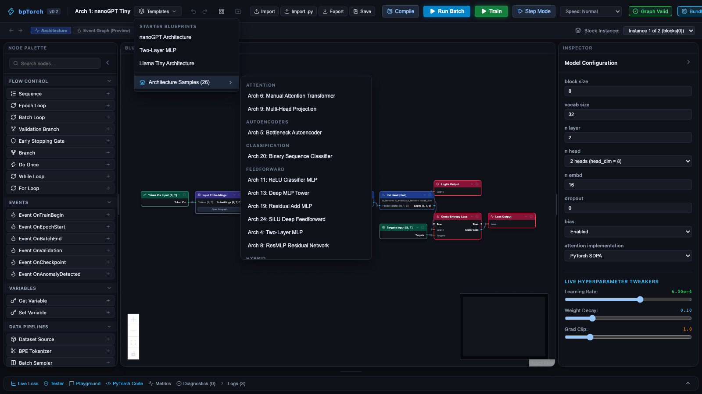
</p>

<p align="center">
  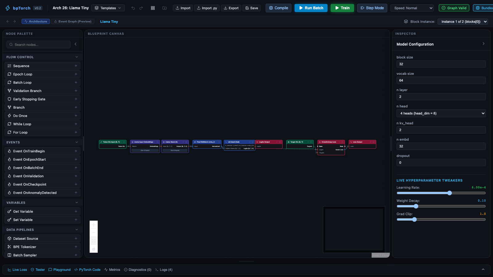
</p>

<p align="center">
  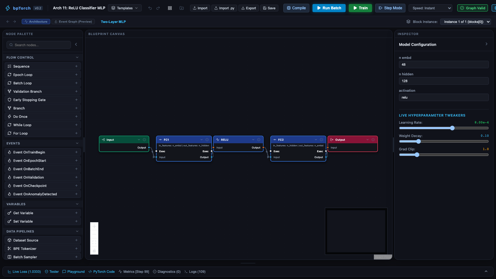
</p>

<p align="center">
  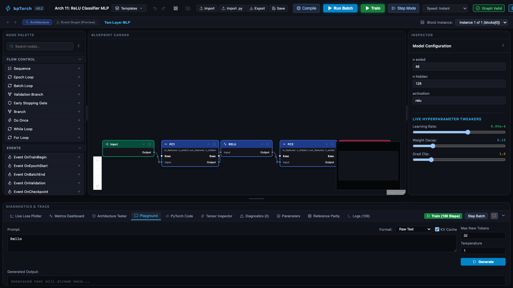
</p>

<p align="center">
  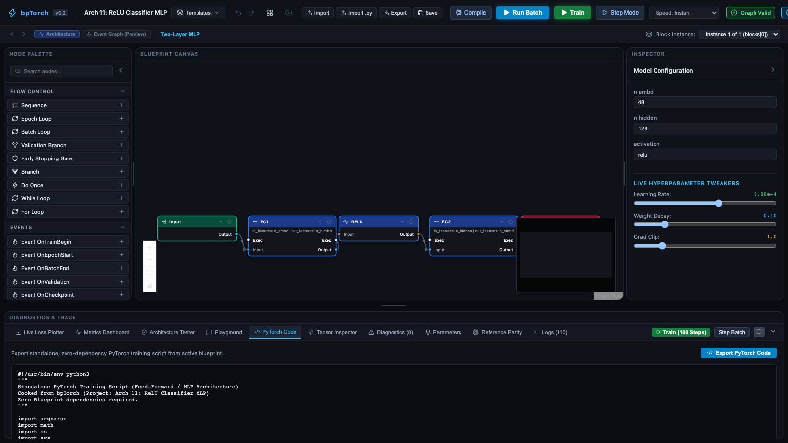
</p>

<p align="center">
  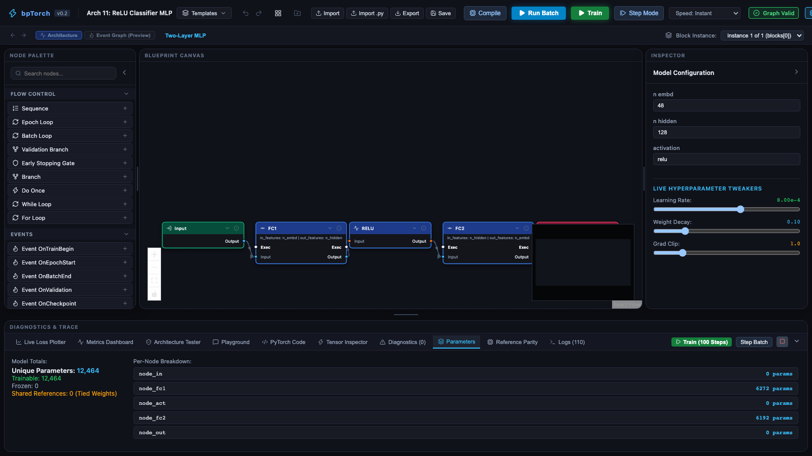
</p>

<p align="center">
  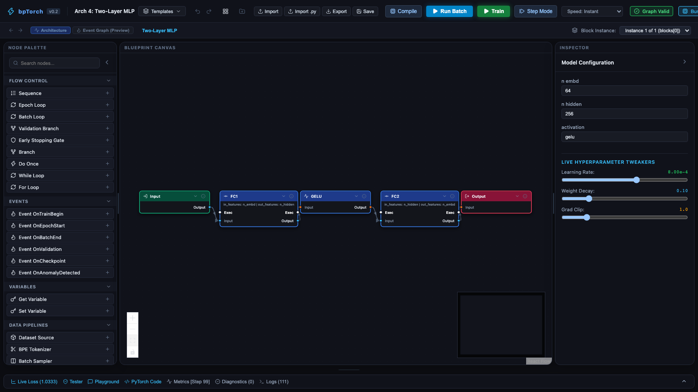
</p>

<p align="center">
  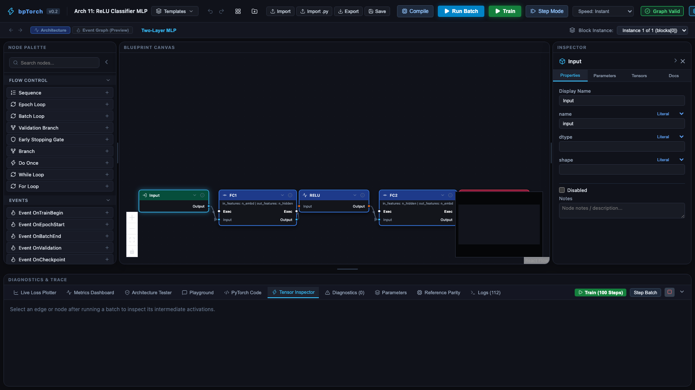
</p>

<p align="center">
  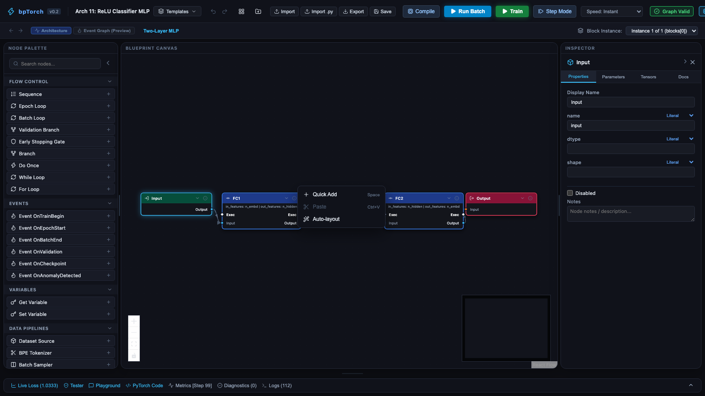
</p>

## License

[Custom Permissive License (with Specific Exclusions)](LICENSE) — see [THIRD_PARTY_NOTICES.md](THIRD_PARTY_NOTICES.md) for bundled references.
